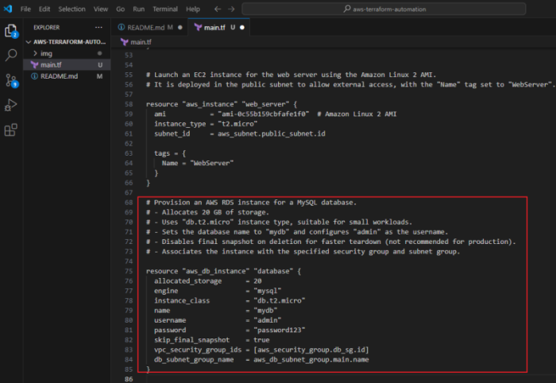
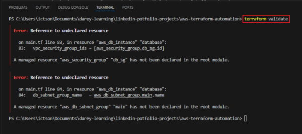
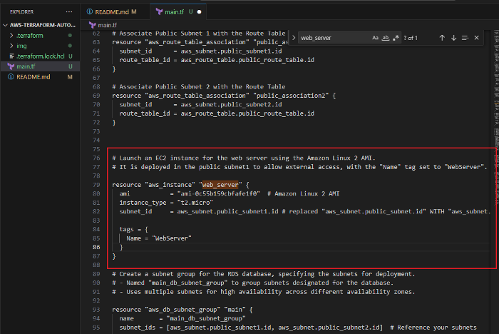
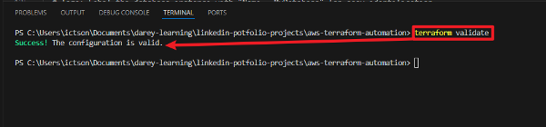
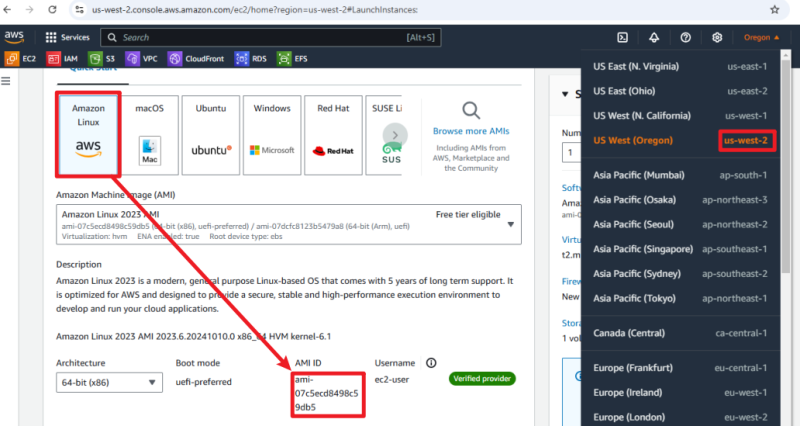
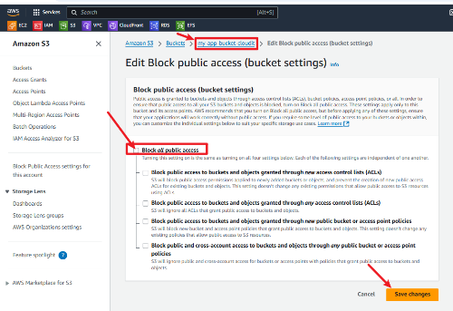

# AWS Infrastructure Automation with Terraform

**Objective:** Use Terraform to automate the provisioning of AWS resources, including VPC, EC2 instances, RDS databases, and S3 buckets.

## **Step 1:** Setting Up the Terraform Project

**Explanation:** Terraform organizes infrastructure as code (IaC) within a project folder. This folder will contain all necessary configuration files.

1. Create a Project Directory:

    - In my terminal or command prompt, I'll set up a directory for the project.

        

2. Initialize the Terraform Project:

    - In this directory, I'll initialize Terraform to download the required providers (e.g., AWS):

        

        **Explanation:** terraform init sets up the project by downloading necessary plugins, specifically the AWS provider, which Terraform will use to interact with AWS services.

## **Step 2:** Defining the Provider

**Explanation:** The provider specifies the cloud platform (AWS) and the configuration for connecting to it, such as the region and access credentials.

1. Create a New File:

    - Inside my project directory, I'll create a file named `main.tf`. This file will contain all configurations.

        

2. Add AWS Provider Configuration:

    - Here I will open `main.tf` and define the AWS provider:

        

        **Explanation:** The provider block tells Terraform to use the AWS platform, specifying the region where resources should be created. If needed, you can use environment variables (e.g., AWS_ACCESS_KEY_ID and AWS_SECRET_ACCESS_KEY) for AWS credentials.

## **Step 3:** Creating a VPC and Networking Resources

**Explanation:** A Virtual Private Cloud (VPC) is an isolated network within AWS where other resources like **EC2** and **RDS** can be hosted securely.

1. Define VPC Configuration:

    

    **Explanation:** The aws_vpc resource creates a VPC with a specified IP range (cidr_block). Tags help label and identify resources.

2. Add Subnets, Internet Gateway, and Routing Table:

    - Define subnets to allow the separation of resources across availability zones, an `internet gateway` for internet access, and a `route table` to manage traffic:

        

        

**Explanation of Each Part**
- Internet Gateway (aws_internet_gateway):

    This allows traffic to and from the internet for resources in the VPC. It’s necessary for public subnets.
- Public Subnets (aws_subnet.public_subnet1 and aws_subnet.public_subnet2):

    -   Defined with different CIDR blocks to segment traffic.
    -   `map_public_ip_on_launch = true` ensures instances launched in these subnets get a public IP.
- Route Table (aws_route_table):

    - Creates a route that sends all outbound traffic (0.0.0.0/0) to the internet gateway.
- Route Table Associations (aws_route_table_association):

    - Associates each public subnet with the public route table, allowing resources in those subnets to route internet traffic through the internet gateway.

## **Step 4:** Creating an EC2 Instance

**Explanation:** EC2 instances are virtual servers. Here, I’ll provision one within the VPC.

1. Add EC2 Resource:

    - In `main.tf`, define an EC2 instance configuration:

        

       ** Explanation:** The `aws_instance` block creates an EC2 instance. The `ami` specifies the Amazon Machine Image (AMI), and `instance_type` defines the instance size. The `subnet ID` places the instance in the public subnet created earlier.

## **Step 5:** Adding an RDS Database

**Explanation:** RDS (Relational Database Service) hosts databases like MySQL or PostgreSQL. It provides managed databases, saving setup and maintenance work.

1. Define RDS Configuration:

    - In `main.tf`, I'll add the following for an RDS instance:
    

        

        **Explanation:** 
        
        - `aws_db_instance` creates the database.

        - `engine` sets the database type (MySQL in this example).

        - The subnet group and security group provide secure access within the VPC.
    
## **Step 6:** Adding an S3 Bucket

**Explanation:** S3 (Simple Storage Service) buckets provide scalable object storage for static files, backups, and more.

1. Define S3 Bucket Configuration:

    - Here I'll Add the S3 resource in `main.tf`:

        

        **Explanation:** The aws_s3_bucket resource creates an S3 bucket with specified permissions. Buckets are globally unique, so modify the name as needed.

## **Step 7:** Apply the Configuration

1. Validate Configuration:

    - Check for any syntax or configuration issues:

        

        The error indicates that Terraform is unable to locate the required AWS provider for my configuration. This can be resolved by initializing Terraform, which downloads any required providers and sets up my workspace. Here’s how to proceed:

1. Run terraform init:

    

    - This command downloads and installs the necessary providers, including `registry.terraform.io/hashicorp/aws`, as specified in your configuration.

2. Validate again:

    - After initialization completes, re-run the validation command to ensure my configuration is correct.

        

        The errors here mean that `aws_security_group.db_sg` and `aws_db_subnet_group.main` are referenced in my configuration, but they haven’t been defined yet in `main.tf`. Here’s how to resolve these by `creating a security group` and a `DB subnet group`.

*To add these resources in `main.tf`:*

1. Define the Security Group `(aws_security_group)` for the Database

    

2. Define the Subnet Group for the Database `(aws_db_subnet_group)`

    

    The DB subnet group allows your database instance to operate within specific subnets.

    Ensure that `aws_subnet.public_subnet1` and `aws_subnet.public_subnet2` are also defined in your configuration. They should correspond to the subnets created within the VPC for database access.

3. Update the aws_db_instance Resource

    - With the security group and subnet group now defined, your aws_db_instance configuration should look like this:

        

4. Re-run terraform validate

    

The errors here indicate the following:

1. Deprecated Argument Warning in S3 Bucket:

    The `acl = "private"` argument in the S3 bucket configuration is now deprecated, and AWS recommends using the `aws_s3_bucket_acl` resource instead.

2. Undeclared Resource in Subnet Reference:

    On line 82, `aws_subnet.public_subnet` is referenced, but this resource hasn’t been declared. Instead, it seems we defined two subnets as `public_subnet1` and `public_subnet2`. You’ll need to adjust the reference to one of these two subnets.

3. Unsupported Argument in `aws_db_instance`:

    The name argument is not valid for aws_db_instance when using specific database engines (e.g., MySQL, PostgreSQL). You should use the identifier argument instead, which is the correct field for naming the DB instance.

## Steps to Fix These Issues

1. Replace: `acl = "private"` with 

    *resource "aws_s3_bucket_acl" "app_bucket_acl" {
        bucket = aws_s3_bucket.app_bucket.id
        acl    = "private"
        }*

    

In this setup:

- `aws_s3_bucket.app_bucket` defines the bucket itself.
- `aws_s3_bucket_acl.app_bucket_acl` separately applies the access control list (ACL), in this case setting it to "private".

2. Correct the Subnet Reference in the Web Server Configuration

    - In my `aws_instance` resource for the `web_server`, I'll replace: `subnet_id = aws_subnet.public_subnet.id` with `subnet_id = aws_subnet.public_subnet1.id`

    

3. Replace `name` with `identifier` in `aws_db_instance`

    - In the `aws_db_instance` resource, I'll replace: `name = "mydb"` with `identifier = "mydb"`

    

## Validate the Configuration Again

- After making these changes, run: `terraform validate`

    

The configuration is now valid so I can now proceed with `terraform plan` and `terraform apply`

- Use `terraform plan` to preview the resources that will be created in AWS:

    

- Apply the Configuration:

Here I encountered three separate errors while deploying my Terraform resources. Here’s how to address each issue:

**1. Invalid AMI ID Error**

- The AMI ID `ami-0c55b159cbfafe1f0` specified for the `aws_instance.web_server` resource is not available in your AWS region (`us-west-2`). To resolve this:
    - Look up the correct AMI ID for your region. For example, to find a valid Amazon Linux 2 AMI in `us-west-2`, check the **AWS AMI documentation** or use the EC2 dashboard.
    - Update the ami field in your `main.tf` file with the new AMI ID and re-run terraform plan and terraform apply.
- Here I will obtian the AMI ID from my EC2 dashboard

**2. DB Subnet Group Availability Zone Coverage Error**

This error indicates that the RDS DB subnet group doesn't cover enough Availability Zones. To fix this:
- I will ensure my `aws_subnet` resources cover at least two different `Availability Zones` in the `us-west-2` region, for example `us-west-2a` and `us-west-2b`.

**3. S3 Bucket ACL Not Supported**

- S3 buckets created without enabling ACLs will not support ACL-based permissions. To fix this:
    - Remove the aws_s3_bucket_acl resource and manage permissions using S3 bucket policies instead, or ensure the bucket supports ACLs.
    - Here I'll  remove the aws_s3_bucket_acl resource from my Terraform code.

- I'll manage permissions using S3 bucket policies instead

## Apply Changes:

-   Run terraform plan to confirm the changes and then terraform apply to implement them.

    

- Run terraform apply

    

    Here I have two separate issues: an `incompatible RDS` instance and `version configuration`, and an `S3 bucket policy permission issue`. Here’s how to resolve each of them:

1. Resolving the RDS Instance Configuration Error

    - Switch to an db.t3.micro instance class

    

2. Resolving the S3 Bucket Policy Access Error

The error shows that the s3:PutBucketPolicy action is denied due to the Block Public Access settings on my S3 bucket.

- Disable the Block Public Access Setting (if Public Access is Required)

Now that I need public access, I'll follow these steps to disable `Block Public Access` temporarily for this bucket:

- Go to the AWS S3 Console.
- Find and select your bucket (my-app-bucket-cloudit).
- Go to the Permissions tab.
- Under Block public access (bucket settings), click Edit.
- Deselect Block public bucket policies.
- Save your changes and apply the Terraform plan again.

- Run terraform apply again

